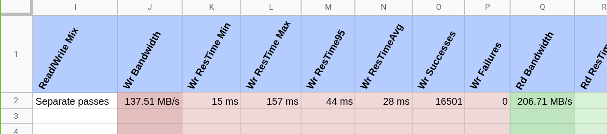
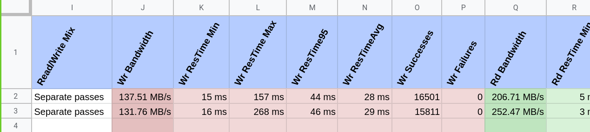
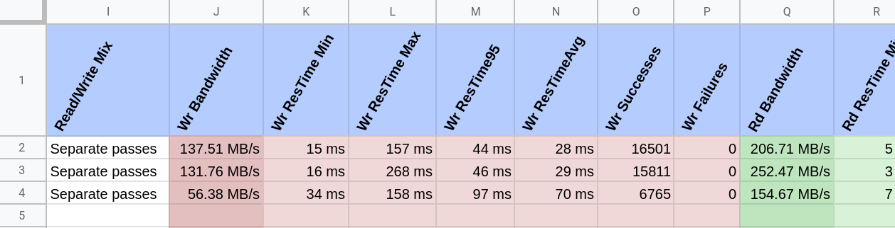
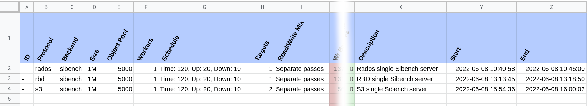
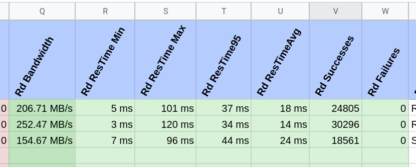

Benchmaster
===========

Benchmaster is a storage benchmarking manager. It doesn't do any benchmarking
itself, but will leverage other tools to do the work (e.g. `sibench` and
`cosbench`).

It will use these other tools to run the benchmarks and extract the relevant
information, to then put the results on a spreadsheet.

Main Benchmaster features:

- Compatible with multiple benchmarking tools
- Integration with Google Spreadsheets

It supports storage benchmarking on many different ways:

- Via multiple APIs: RBD, Rados, S3.
- Direct access: File system, or block device.

Installation
------------

On a Debian system, install the dependencies::

    sudo apt-get install python3-pip sshpass

On Fedora, you can install the dependencies with::

    sudo dnf install python3-pip sshpass

Once you have the base dependencies in place, you can install Benchmaster
straight from GitHub::

    pip3 install pip install https://github.com/softiron/benchmaster/archive/master.zip

Spreadsheet integration
-----------------------

To be able to use Benchmaster to create Spreadsheets and upload data to them,
you must create a service account. You can follow `gspread documentation`_
about how to create a service account.

.. _gspread documentation: https://docs.gspread.org/en/latest/oauth2.html#enable-api-access-for-a-project

Save the service account credentials on a file called ``gcreds.json`` and run
``benchmaster`` from the folder containing that file, or use the
``--google-credentials FILE`` option. (See ``benchmaster --help``).

Examples
--------

Once you have the service account ready, running Benchmaster can be as simple
as running Sibench.

First of all, you need to create a spreadsheet for your benchmarking data::

    benchmaster sheet create "benchmaster example tests" bench@example.com another@example.com

This will create a spreadsheet named "benchmaster example tests" owned by the
service account, and shared with "bench@example.com" and "another@example.com"

With the spreadsheet ready you can start running some benchmarks.

You will notice that Benchmaster connects to your Ceph Monitors or Gateways via
an ``ssh`` connection to the ``root`` user. This will be used to retrieve
Ceph Admin key, or to create a Rados Gateway user in the case of ``benchmaster
s3 adduser``. In any case, you can specify the Ceph user and Key using the optons
``--ceph--user`` and ``--ceph-key``.

Benchmarking Rados using Sibench
~~~~~~~~~~~~~~~~~~~~~~~~~~~~~~~~

You may need to create an user and a pool for these. Read the :doc:`examples`
page for information about how to do it.

For an initial benchmark with Benchmaster, using default values, and a single
Sibench server running locally::

    benchmaster rados sibench time --sheet "benchmaster example tests" \
      --ceph-user sibench --ceph-key AQASFmhiN2aiCBARYd1iIdn2ntHGoFjL3QJiTA== \
      --ceph-pool sibench.pool "Rados single Sibench server" ceph-mon1

As explained on :ref:`targets section <examples:rados-and-rbd-benchmarking>`.

An example of the output you should get after running the command above:

        using Sibench.

Benchmarking RBD using Sibench
~~~~~~~~~~~~~~~~~~~~~~~~~~~~~~

In a similar way, we can use the same user, key, and pool to run a a benchmark
using RBD protocol::

    benchmaster rbd sibench time --sheet "benchmaster example tests" \
      --ceph-user sibench --ceph-key AQASFmhiN2aiCBARYd1iIdn2ntHGoFjL3QJiTA== \
      --ceph-pool sibench.pool "RBD single Sibench server" ceph-mon1

Now in the spreadsheet you should be able to see a second row for this
benchmark run.

        using Sibench.

Benchmarking S3 using Sibench
~~~~~~~~~~~~~~~~~~~~~~~~~~~~~

If you want to run benchmaks using the S3 protocol you will need an S3 user.
You can use the command ``benchmaster s3 adduser`` to do this, or you can add
it manually yourself as explained on the :doc:`examples` page and saving the
first element of the ``keys`` list to a file.

For simplicity, you can use the helper command to create the user for you::

    benchmaster s3 adduser benchmaster ceph-rgw1

And then, run the benchmark against your Rados Gateway nodes::

    benchmaster s3 sibench time --sheet "benchmaster example tests" \
      "S3 single Sibench server" ceph-rgw1 ceph-rgw2 ceph-rgw3

Once it finishes, you should see an additional row in your spreadsheet.

        using Sibench.

The spreadsheet
~~~~~~~~~~~~~~~

On the initial colums of the spreadsheet you can find:

- ID of the run (COSbench only)
- Protocol used
- Backend (Sibench or COSbench)
- Size of the object used
- Number of object used
- Workers running the test (e.g. number of Sibench servers)
- Test timings (ramp up, testing and ramp down)
- Number of targets (Monitor, Rados Gateway, etc)

On the final columns you will only see the description given to the test and the
start and end times.

On the central colums of the spreasheet you will see the output of the test.
You will see in Red, the Write results, and in Green, the Read results. For
both operation types you will see:

- Bandiwtdth
- Response times
- Number of successful operations
- Number of failed operations

