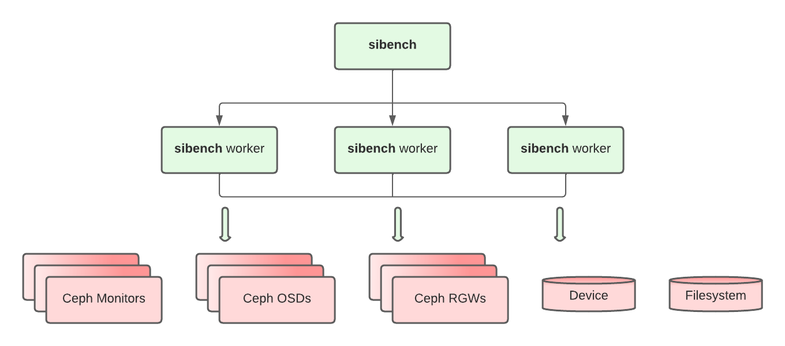

Sibench
=======

.. include:: sibench-short-intro.txt

It has support for file, block and object storage backends, using a variety of
different protocols, which currently include:

- Rados: Ceph's native object protocol.
- RBD: Ceph's block protocol.
- CephFS: Ceph's POSIX filesystem protocol.
- S3: Amazon's object protocol, which is always provided by Ceph's RadosGateway.
- Local block storage
- Local file storage

These last two can be used to benchmark many other protocols - iSCSI, SMB, NFS
and so on - provided that these have been manually mounted on each Sibench
node.

Architecture
------------

Sibench has a client-server architecture. The client doing benchmarking will
communicate with the Sibench servers to generate the load. This way Sibench
can generate a distributed load to avoid any bottlenecks caused by running
benchmarks from a single location.

        the multiple benchmarking backends.

To use Sibench from multiple nodes you will need to install it on all of
these nodes, including the client and the servers.

Have a look at some :doc:`examples` and also to the :doc:`manual` to continue
learning about Sibench.

You don't have Sibench installed yet? Have a look at the :doc:`installation`
page.

Contributing
------------

* This documentation can be seen at https://sibench.io
* Check Sibench source code: https://github.com/softiron/sibench
* Documentation source:
  https://github.com/softiron/sibench/tree/master/docs/source
* For bug reports and feature requests create a GitHub issue:
  https://github.com/softiron/sibench/issues

.. toctree::
   :maxdepth: 2
   :caption: Contents:
   :hidden:

   self
   installation
   manual
   examples
   best-practices
   benchmaster
